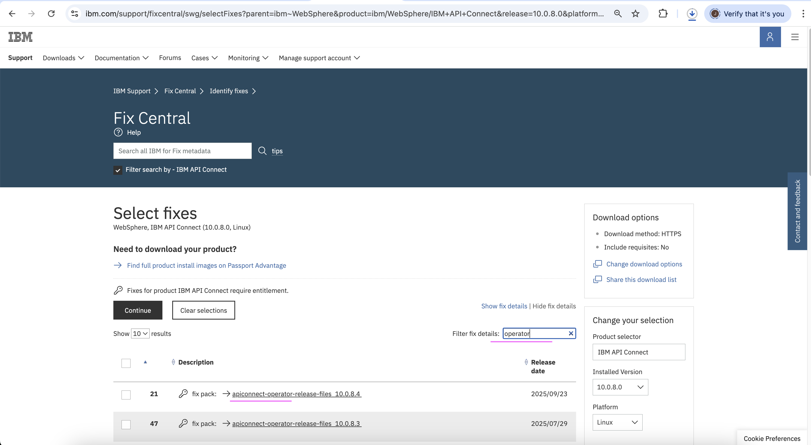

# Downloading API connect files

Refer the product documentation [here](https://www.ibm.com/docs/en/api-connect/10.0.x_cd?topic=procedures-obtaining-product-files) for more detailed info about obtaining product files

## 1. Download IBM API Connect for Containers

Need to download the Docker images for all API Connect subsystems. 

1. Goto to the IBM Fix Central https://www.ibm.com/support/fixcentral/swg/downloadOptions
2. Do login with IBM Id.
3. Choose the tab **Find product**
4. Then choose the following values
    - **Product selector*** : IBM API Connect
    - **Installed Version*** : 10.0.8.0
    - **Platform** : Linux
5. Click on **Continue** button
    

6. Click on **Continue** button
    

7. In **Filter fix details:** enter **apiconnect-image-tool_10.0.8.4**

    You will get the filterd record **fix pack: → apiconnect-image-tool 10.0.8.4**

8. Click on **Continue** button

    

9. Choose **Download using your browser (HTTPS)**

10. Click on **Continue** button

    

11. Click on **I Agree** button

    

13. Click on **Download Icon** to start the download

    It will start downloading and take upto few hours.

    

#### 2. Download IBM API Connect Operator Release Files for Containers

Need to download the Kubernetes operators and API Connect Custom Resource (CR) templates 

From the 7th step on the above section, you can continue in this.

1. In **Filter fix details:** enter **operator**

    You will get the filterd record **fix pack: fix pack: → apiconnect-operator-release-files 10.0.8.4**

2. Click on **Continue** button

    

3. Click on **I Agree** button

    

4. Click on **Download Icon** to start the download

    It will start downloading and take upto few minutes only to download.

    
