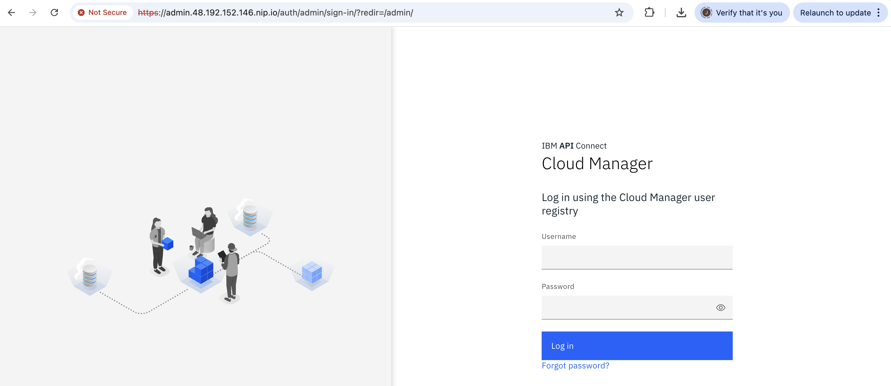
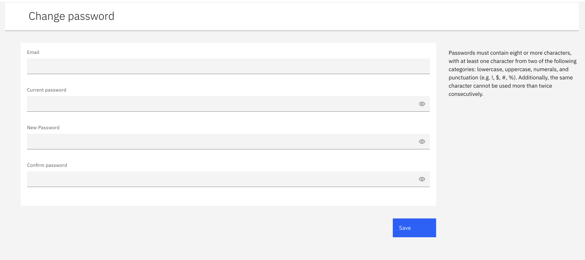
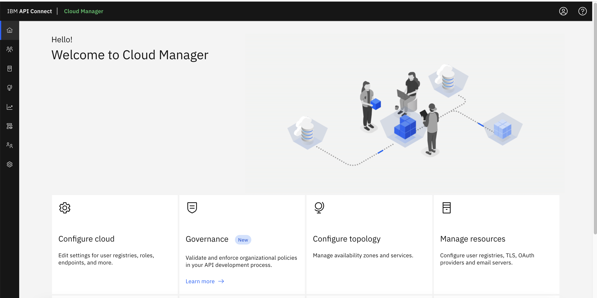

# Installing API Connect in AKS

# 1. Obtaining product files

<details><summary>CLICK ME</summary>

Refer the product documentation [here](https://www.ibm.com/docs/en/api-connect/10.0.x_cd?topic=procedures-obtaining-product-files) for more detailed info, but you don't need to use this for the installation.

### 1. Obtain the API Connect files

Follow the documentation [here](../01-download-api-connect-binaries) and download the binaries.

### 2. Load the image-tool image in your Docker local registry

1. Run the below command.

  ```
  docker load -i apiconnect-image-tool_10.0.8.4.tar.gz
  ```

  or 

  ```
  docker load apiconnect-image-tool_10.0.8.4.tar.gz
  ```

### 3. Upload the product images from local registry to remote Docker registry


1. Replace the values of the following variables as required
2. Run the below commands.
```
export DOCKER_SERVER=docker.io
export DOCKER_USERNAME=test_user
export DOCKER_PASSWORD=test_password
```
3. Run the following commmand to login into the registry

```
docker login $DOCKER_SERVER -u $DOCKER_USERNAME  -p $DOCKER_PASSWORD
```

4. Run the following commmand to upload the image from local registry to the remote docker registry

```
docker run --rm apiconnect-image-tool-10.0.8.4 upload $DOCKER_SERVER/$DOCKER_USERNAME
```
or

```
docker run --rm apiconnect-image-tool-10.0.8.4 upload $DOCKER_SERVER --username $DOCKER_USERNAME --password $DOCKER_PASSWORD
```
</details>


# 2. Ingress controller prerequisites

## 2.1 Install Kubernetes ingress controller 

<details><summary>CLICK ME</summary>

Refer the product documentation [here](https://www.ibm.com/docs/en/api-connect/10.0.x_cd?topic=deployment-kubernetes-ingress-controller-prerequisites) for more detailed info, but you don't need to use this for the installation.

A Kubernetes deployment for IBM API Connect requires the **kubernetes/ingress-nginx** ingress controller implementation (see https://github.com/kubernetes/ingress-nginx) with SSL passthrough enabled.

1. Login into the Kubernetes cluster via kubectl cli.

2. Dowload the sample [ingress-config.yaml](./files/ingress-config.yaml) file to configure the ingress controller.

3. Run the following commands to make the **helm** repo ready.

```
helm repo add ingress-nginx https://kubernetes.github.io/ingress-nginx
helm repo update
```

4. With the above downloaded **ingress-config.yaml** file run the following command.
```
helm install ingress-controller ingress-nginx/ingress-nginx --namespace kube-system --values ingress-config.yaml
```
</details>

## 2.2 Install ingress-nginx

<details><summary>CLICK ME</summary>

1. Run the below command to install ingress-nginx.

  ```
  kubectl apply -f https://raw.githubusercontent.com/kubernetes/ingress-nginx/main/deploy/static/provider/cloud/deploy.yaml
  ```

2. Run the below command to know the External IP Address cluster.
  ```
  kubectl get service ingress-nginx-controller -n ingress-nginx
  ```
you may get the below output.

  ```
  NAME                       TYPE           CLUSTER-IP    EXTERNAL-IP      PORT(S)                      AGE
  ingress-nginx-controller   LoadBalancer   10.0.15.218   22.33.44.55   80:30172/TCP,443:31150/TCP   89m
  ```
3. Note the IP Address displayed under the `EXTERNAL-IP` column ex: `22.33.44.55`.

</details>


# 3. Deploying operators

<details><summary>CLICK ME</summary>

Refer the product documentation [here](https://www.ibm.com/docs/en/api-connect/10.0.8_lts?topic=docm-deploying-operators-in-single-namespace-api-connect-cluster) for more detailed info, but you don't need to use this for the installation.


### 3.1. Create Namespace

1. Run the following command to create namespace

```
kubectl create ns apiconnect
```

### 3.2. Install Certificate Manager

Need to Get a certificate manager. API Connect uses cert-manager v1.18.1 of cert-manager, which is a native Kubernetes certificate management controller. You can obtain `cert-manager v1.18.1` from the API Connect v10 distribution `helper_files.zip` archive, or download it from https://github.com/cert-manager/cert-manager/releases/tag/v1.18.1

1. Download the file [cert-manager.yaml](./files/cert-manager.yaml) from this repo.

2. Run the following command to apply the CR

```
kubectl apply -f cert-manager.yaml
```

3. Wait for `cert-manager` pods to enter `Running 1/1` status before proceeding. To check the status, run the below command.
```
kubectl get po -n cert-manager 
```

### 3.3. Create registry secret

Need to create a registry secret with credentials to be used to pull down product images.

1. Replace the values of the following variables as required
2. Run the below commands.
```
export DOCKER_SERVER=docker.io
export DOCKER_USERNAME=test_user
export DOCKER_PASSWORD=test_password
export DOCKER_EMAIL="none@none.com"
```
3. Run the following commmands to create 3 secrets

```
kubectl create secret docker-registry apic-registry-secret --docker-server=$DOCKER_SERVER --docker-username=$DOCKER_USERNAME --docker-password=$DOCKER_PASSWORD --docker-email=$DOCKER_EMAIL  -n apiconnect

kubectl create secret docker-registry datapower-docker-local-cred --docker-server=$DOCKER_SERVER --docker-username=$DOCKER_USERNAME --docker-password=$DOCKER_PASSWORD --docker-email=$DOCKER_EMAIL  -n apiconnect

kubectl create secret generic datapower-admin-credentials --from-literal=password=admin -n apiconnect
```

### 3.4. Install API Connect CRDs

1. Download the file  [ibm-apiconnect-crds1.yaml](./files/ibm-apiconnect-crds1.yaml) from this repo.

2. Run the following command to deploy the same

```
kubectl apply -f ibm-apiconnect-crds1.yaml -n apiconnect
```

3. Download the file  [ibm-apiconnect-crds2.yaml](./files/ibm-apiconnect-crds2.yaml) from this repo.

4. Run the following command to deploy the same

```
kubectl apply -f ibm-apiconnect-crds2.yaml -n apiconnect
```

### 3.5. Install API Connect Operator

1. Download the file  [ibm-apiconnect.yaml](./files/ibm-apiconnect.yaml) from this repo.

2. In the downloaded file, replace the text `docker.io/test_user` with docker registry name and user name.

3. Run the following command to deploy the same

```
kubectl apply -f ibm-apiconnect.yaml -n apiconnect
```

ibm-datapower

### 3.6. Install Data Power Operator

1. Download the file  [ibm-datapower.yaml](./files/ibm-datapower.yaml) from this repo.

2. In the downloaded file, replace the text `docker.io/test_user` with docker registry name and user name.

3. Run the following command to deploy the same

```
kubectl apply -f ibm-datapower.yaml -n apiconnect
```

ibm-datapower

### 3.7. Install ingress-ca Issuer to be used by cert-manager

1. Download the file  [ingress-issuer-v1.yaml](./files/ingress-issuer-v1.yaml) from this repo.

2. Run the following command to deploy the same

```
kubectl apply -f ingress-issuer-v1.yaml -n apiconnect
```

3. Validate that the command succeeded by running the below command.


```
kubectl get certificates -n apiconnect
```

You may get the output like this
```
NAME                         READY   SECRET                       AGE
analytics-ingestion-client   True    analytics-ingestion-client   70s
gateway-peering              True    gateway-peering              69s
gateway-service              True    gateway-service              69s
ingress-ca                   True    ingress-ca                   71s
portal-admin-client          True    portal-admin-client          71s
portal-tunnel-client         True    portal-tunnel-client         70s
```
</details>

# 4. Installing the management subsystem

<details><summary>CLICK ME</summary>

Refer the product documentation [here](https://www.ibm.com/docs/en/api-connect/10.0.x_cd?topic=subsystems-installing-management-subsystem) for more detailed info, but you don't need to use this for the installation.

### 4.1 Download the file

1. Download the file  [management_cr.yaml](./files/management_cr.yaml) from this repo.

### 4.2 Update the info (Must do)

In the downloaded file, replace the following info.

1. Update the host name of the Docker Registry to which you uploaded the installation images.
```
imageRegistry: docker.io/test_user
```
2. Need to Update the desired ingress subdomain for the API Connect stack. 

  - If you have actual end point of your cluster then and replace the `111.222.333.444.nip.io` with the actual end point of your cluster. 
  - If you don't have/know the end point, then use the  `EXTERNAL-IP` column value we got it step 2.2 and replace the `111.222.333.444` with the actual end point of your cluster.

### 4.3 Update the info (if you need)

In the downloaded file, replace the following info only if required.

1. Update the API Connect application version.
```
version: 10.0.8.4
```

2. Update the profile.
```
profile: n1xc2.m16
```

3. Update the stroage class name.
```
storageClassName: managed-premium
```

4. Update the License info
```
  license:
    accept: true
    use: nonproduction
    license: L-HTFS-UAXYM3
```

### 4.4 Install the management CR

1. Run the following command to deploy the same

```
kubectl apply -f management_cr.yaml -n apiconnect
```

2. Verify that the management subsystem is fully installed:

```
kubectl get ManagementCluster -n apiconnect
```

The installation has completed when the READY status is True, and the SUMMARY reports that all services are online (e.g. 16/16). For example:
```
NAME         READY   SUMMARY   VERSION    RECONCILED VERSION   AGE
management   True   16/16       <version>   <version-build>       7m17s
```

### 4.5 Accessing Admin Portal

Let us access the Cloud Manager user interface as part of the management subsystem,

1. Run the below command to get the Password for the portal.

```
kubectl get secret -n apiconnect management-admin-secret -o jsonpath="{.data.password}" | base64 -d && echo ""
```

2. The end point of the url might be like this. Replace it with the appropriate ip or url.

```
https://admin.111.222.333.444.nip.io/admin
```

3. Login into the portal

  - UserName : admin
  - Password : Retrieved in the above step

  


4. Change the password

  

5. Home page of the portal is dispalyed.

  


</details>

# 5. Installing the gateway subsystem

<details><summary>CLICK ME</summary>

Refer the product documentation [here](https://www.ibm.com/docs/en/api-connect/10.0.x_cd?topic=subsystems-installing-gateway-subsystem) for more detailed info, but you don't need to use this for the installation.

### 5.1 Download the file

1. Download the file  [apigateway_cr.yaml](./files/apigateway_cr.yaml) from this repo.

### 5.2 Update the info (Must do)

In the downloaded file, replace the following info only if required.

1. Update the host name of the Docker Registry to which you uploaded the installation images.
```
imageRegistry: docker.io/test_user
```
 2. Need to Update the desired ingress subdomain for the API Connect stack. 

  - If you have actual end point of your cluster then and replace the `111.222.333.444.nip.io` with the actual end point of your cluster. 
  - If you don't have/know the end point, then use the  `EXTERNAL-IP` column value we got it step 2.2 and replace the `111.222.333.444` with the actual end point of your cluster.


### 5.3 Update the info (if you need)

In the downloaded file, replace the following info only if required.

1. Update the API Connect application version.
```
version: 10.0.8.4
```

2. Update the profile
```
profile: n1xc4.m8
```

3. Update the stroage class name.
```
storageClassName: managed-premium
```

4. Update the License info
```
  license:
    accept: true
    use: nonproduction
    license: L-HTFS-UAXYM3
```

### 5.4 Install the Gateway CR

1. Run the following command to deploy the same.

```
kubectl apply -f apigateway_cr.yaml -n apiconnect
```

2. Verify that the management subsystem is fully installed by running this command.

```
kubectl get GatewayCluster -n apiconnect
```

The installation has completed when the READY status is True, and the SUMMARY reports that all services are online (e.g. 3/3). For example:
```
NAME   READY   SUMMARY   VERSION    RECONCILED VERSION   AGE
gwv6   3/3     Running   10.0.8.4   10.0.8.4-3237        8h
```
</details>

# 6. Installing the developer portal subsystem

<details><summary>CLICK ME</summary>

Refer the product documentation [here](https://www.ibm.com/docs/en/api-connect/10.0.x_cd?topic=subsystems-installing-developer-portal-subsystem) for more detailed info, but you don't need to use this for the installation.

### 6.1 Download the file

1. Download the file  [portal_cr.yaml](./files/portal_cr.yaml) from this repo.

### 6.2 Update the info (Must do)

In the downloaded file, replace the following info only if required.

1. Update the host name of the Docker Registry to which you uploaded the installation images.
```
imageRegistry: docker.io/test_user
```

 2. Need to Update the desired ingress subdomain for the API Connect stack. 

  - If you have actual end point of your cluster then and replace the `111.222.333.444.nip.io` with the actual end point of your cluster. 
  - If you don't have/know the end point, then use the  `EXTERNAL-IP` column value we got it step 2.2 and replace the `111.222.333.444` with the actual end point of your cluster.

### 6.3 Update the info (if you need)

In the downloaded file, replace the following info only if required.

1. Update the API Connect application version.
```
version: 10.0.8.4
```

2. Update the profile,
```
profile: n1xc4.m16
```

3. Update the stroage class names in all the places.
```
storageClassName: managed-premium
```

4. Update the License info
```
  license:
    accept: true
    use: nonproduction
    license: L-HTFS-UAXYM3
```

### 6.4 Install the Portal CR

1. Run the following command to deploy the same.

```
kubectl apply -f portal_cr.yaml -n apiconnect
```

2. Verify that the developer portal is fully installed by running this command.

```
kubectl get PortalCluster -n apiconnect
```

The installation has completed when the status is in Running and READY should have value like 5/5. For example:
```
NAME     READY   STATUS    VERSION    RECONCILED VERSION   MESSAGE                                            AGE
portal   5/5     Running   10.0.8.4   10.0.8.4-3237        Ready for API Cloud Manager service registration   3m35s
```


### 6.5 Access the portal

The portal URL would be like this. You can change the URL as per your configuration. 

1. Access the portal in the browser using this URL (after replace the IP with the appropriate ip or url).

```
https://portal.111.222.333.444.nip.io/
```

You may see the following text in the screen.
```
Developer Portal is ready to create sites!
If you see this page, the web server is successfully installed and working. Further configuration is required.
```

### 6.6 Configuration

Need to register a portal service. Follow this [link](https://www.ibm.com/docs/en/api-connect/10.0.x_cd?topic=topology-registering-portal-service) to configure the same.

</details>

# 7. Installing the analytics subsystem

<details><summary>CLICK ME</summary>

Refer the product documentation [here](https://www.ibm.com/docs/en/api-connect/10.0.x_cd?topic=subsystems-installing-analytics-subsystem) for more detailed info, but you don't need to use this for the installation.

### 7.1 Download the file

1. Download the file  [analytics_cr.yaml](./files/analytics_cr.yaml) from this repo.

### 7.2 Update the info (Must do)

In the downloaded file, replace the following info only if required.

1. Update the host name of the Docker Registry to which you uploaded the installation images.
```
imageRegistry: docker.io/test_user
```
 2. Need to Update the desired ingress subdomain for the API Connect stack. 

  - If you have actual end point of your cluster then and replace the `111.222.333.444.nip.io` with the actual end point of your cluster. 
  - If you don't have/know the end point, then use the  `EXTERNAL-IP` column value we got it step 2.2 and replace the `111.222.333.444` with the actual end point of your cluster.

### 7.3 Update the info (if you need)

In the downloaded file, replace the following info only if required.

1. Update the API Connect application version.
```
version: 10.0.8.4
```

2. Update the profile
```
profile: n1xc4.m32
```

3. Update the stroage class name.
```
storageClassName: azurefile-csi-premium
```

4. Update the License info
```
  license:
    accept: true
    use: nonproduction
    license: L-HTFS-UAXYM3
```

### 7.4 Install the analytics CR

1. Download the file  [sysctl-vm-max-map-count.yaml](./files/sysctl-vm-max-map-count.yaml) from this repo.

2. Run the following command to deploy the same.

```
kubectl apply -f sysctl-vm-max-map-count.yaml
```

3. Run the following command to deploy the CR.

```
kubectl apply -f analytics_cr.yaml -n apiconnect
```

4. Verify that the analytics subsystem is fully installed by running this command.

```
kubectl get AnalyticsCluster -n apiconnect
```

The installation has completed when the status is in Running and READY should have value like 8/8. 
```
NAME        READY   STATUS    VERSION    RECONCILED VERSION   AGE
analytics   8/8     Running   10.0.8.4   10.0.8.4-3237        48m
```

#### Debugging

If any are not ready in the above output you need to see pod status.

1. Run this command.

```
kubectl get pods -n apiconnect
```

You may have a pod in CrashLoopBackOff status.
```
NAME                                                    READY   STATUS             RESTARTS        AGE
analytics-storage-0                                     1/2     CrashLoopBackOff   9 (4m44s ago)   29m
```

2. Get the logs of the pod by running the below command.

```
kubectl logs analytics-storage-0 -n apiconnect
```

you may have the logs like this.
```
[2025-10-23T02:28:51,472][INFO ][o.o.t.TransportService   ] [analytics-storage-0] Remote clusters initialized successfully.
[2025-10-23T02:28:52,142][INFO ][o.o.b.BootstrapChecks    ] [analytics-storage-0] bound or publishing to a non-loopback address, enforcing bootstrap checks
ERROR: [1] bootstrap checks failed
[1]: max virtual memory areas vm.max_map_count [65530] is too low, increase to at least [262144]
ERROR: OpenSearch did not exit normally - check the logs at /usr/share/opensearch/logs/apic-analytics-cluster.log
[2025-10-23T02:28:52,153][INFO ][o.o.s.a.r.AuditMessageRouter] [analytics-storage-0] Closing AuditMessageRouter
[2025-10-23T02:28:52,154][INFO ][o.o.n.Node               ] [analytics-storage-0] stopping ...
```

This shows the probelm with the virtual memory.


3. Download the file  [sysctl-vm-max-map-count.yaml](./files/sysctl-vm-max-map-count.yaml) from this repo.

4. Run the following command to deploy the same.

```
kubectl apply -f sysctl-vm-max-map-count.yaml
```

5. Run this command.

```
kubectl get pods -n apiconnect
```

You may not have a pod in CrashLoopBackOff status.

</details>