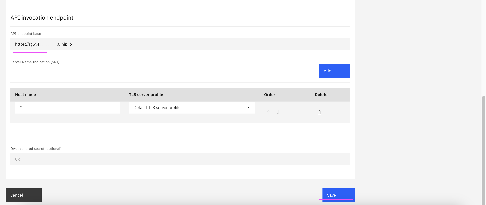

# Configuring DataPower API Gateway

 1. Click on **Configure topology** tile
  

 2. Click on **Register Service** button
  

 3. Click on **DataPower API Gateway** tile
  

 4. Enter the below details.
  - **Title :** Any value
  - **Management endpoint on the gateway service :** https://rgwd.111.222.333.444.nip.io
  - **API Endpoing Service :** https://rgw.111.222.333.444.nip.io

 5. Click on **Save** button

  
  
  

  The service get created.
  
